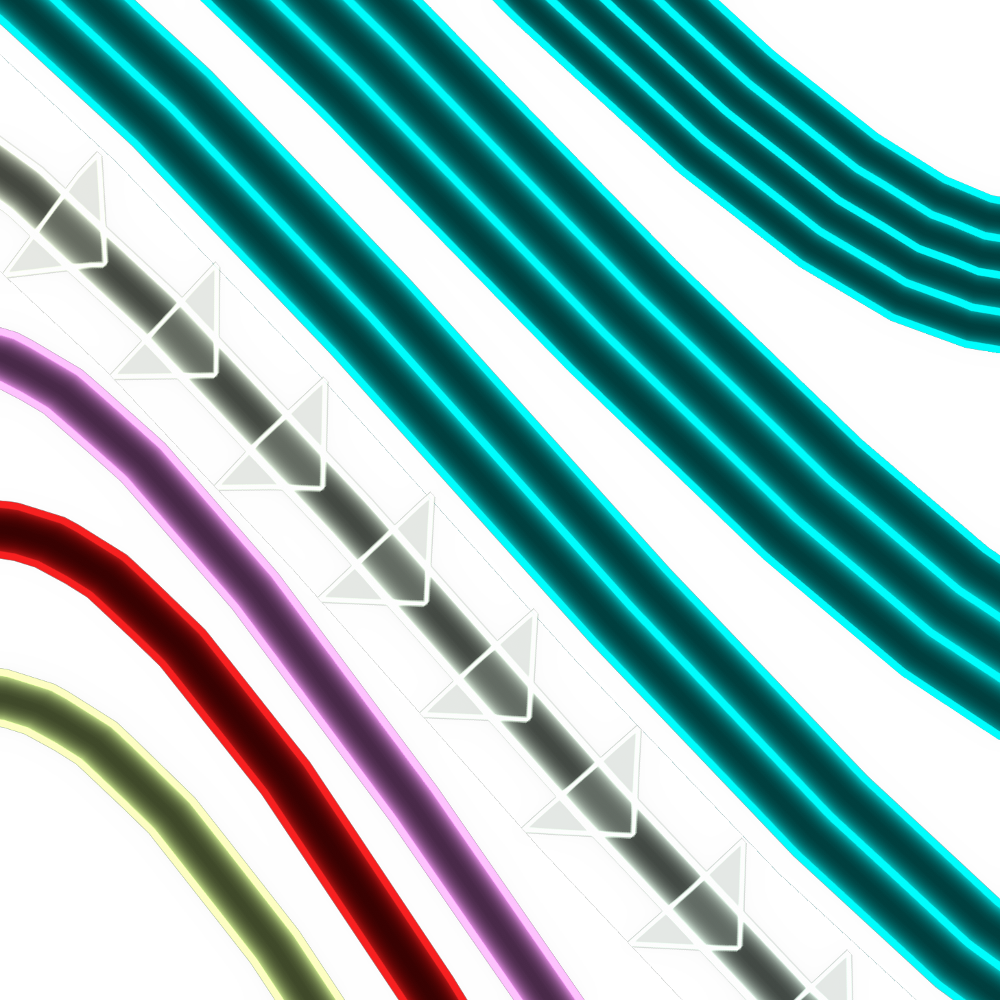
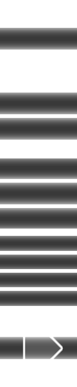
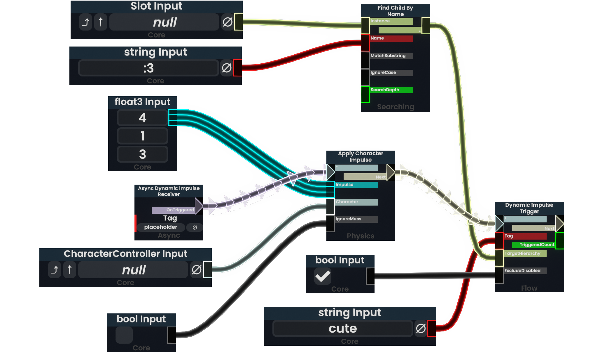

PFO but wires only (testing spaghetti texture)

# **ProtoFluxOverhaul**

*Woof woof!* A [ResoniteModLoader](https://github.com/resonite-modding-group/ResoniteModLoader) mod for [Resonite](https://resonite.com/) that adds customizable animated textures to ProtoFlux wires! 🐾

| Node Closeup | Wire Closeup | Wire Texture |
|:-------------:|:-------------:|:-------------:|
|  |  |  

| Example |
|:-------------:|
|  | 

## 🦴 Features

- Overhauls the UI of ProtoFlux nodes
- Customizable, Connector, Wire, and Node Textures
- Comprehensive UI customization options
- Optimizes wire rendering with shared materials
- Configurable animation speed and direction

## 🐕 Installation

1. Install [ResoniteModLoader](https://github.com/resonite-modding-group/ResoniteModLoader) ([Wiki Installation Guide](https://github.com/resonite-modding-group/ResoniteModLoader/wiki/Installation))
2. Place `ProtoFluxOverhaul.dll` into your `rml_mods` folder. This folder should be at `C:\Program Files (x86)\Steam\steamapps\common\Resonite\rml_mods` for a default install. You can create it if it's missing, or if you launch the game once with ResoniteModLoader installed it will create this folder for you.
3. Start the game. If you want to verify that the mod is working you can check your Resonite logs.

## 🎾 Configuration

The mod comes with extensive configurable options organized into several categories:

### Basic Settings

| Setting | Default | Description |
|---------|---------|-------------|
| `Enabled` | `true` | Enable/disable the mod |
| `Enable Debug Logging` | `false` | Enable debug logging for troubleshooting |
| `Colored Node Background` | `false` | Use node type color as the node background tint |
| `Use PlatformColorPalette` | `false` | Drive connector/node colors from `PlatformColorPalette` |
| `Enable Connector Label Backgrounds` | `true` | Enable the background images on connector labels |
| `Auto Rebuild Selected Nodes` | `false` | Rebuild selected nodes to apply styling (local-only visuals) |
| `Enable Header Background` | `true` | Enable the header background image |
| `Enable Footer Category Text` | `true` | Enable the category text at the bottom of nodes |

### Animation Settings

| Setting | Default | Description |
|---------|---------|-------------|
| `Scroll Speed` | `[-0.5; 0]` | Wire animation speed (X,Y) |
| `Scroll Repeat Interval` | `[1; 1]` | Wire animation repeat interval (X,Y) |

### Texture URLs

| Setting | Example | Description |
|---------|---------|-------------|
| `Wire Texture` | `resdb:///example.png` | Main wire texture |
| `Default Connector \| Both \| Texture` | `resdb:///example.png` | Default connector texture |
| `Call Connector \| Input \| Texture` | `resdb:///example.png` | Call/flow input connector texture |
| `Call Connector \| Output \| Texture` | `resdb:///example.png` | Call/flow output connector texture |
| `x1 Connector \| Texture` | `resdb:///example.png` | Vector x1 connector texture |
| `x2 Connector \| Texture` | `resdb:///example.png` | Vector x2 connector texture |
| `x3 Connector \| Texture` | `resdb:///example.png` | Vector x3 connector texture |
| `Node Background \| Texture` | `resdb:///example.png` | Node background texture |
| `Node Background Header \| Texture` | `resdb:///example.png` | Node header background texture |
| `Shading \| Texture` | `resdb:///example.png` | Shading overlay texture |
| `Shading Inverted \| Texture` | `resdb:///example.png` | Inverted shading overlay texture |

### Audio Settings

| Setting | Default | Description |
|---------|---------|-------------|
| `Wire Sounds` | `true` | Enable wire interaction sounds |
| `Node Sounds` | `true` | Enable node interaction sounds |
| `Grab Sound` | `resdb:///example.wav` | Sound when grabbing a wire/node |
| `Delete Sound` | `resdb:///example.wav` | Sound when deleting a wire |
| `Connect Sound` | `resdb:///example.wav` | Sound when connecting a wire |
| `Node Create Sound` | `resdb:///example.wav` | Sound when spawning a node |
| `Node Grab Sound` | `resdb:///example.wav` | Sound when grabbing a node |
| `Audio Volume` | `1.0` | Volume level for sounds |
| `Audio Min Distance` | `0.1` | Minimum distance for 3D audio falloff |
| `Audio Max Distance` | `25.0` | Maximum distance for 3D audio falloff |

> **Note**: To switch a wire's appearance, it needs to be destroyed and re-created - simply reconnecting will reuse the old wire.

## ⚙️ Advanced Configuration

For users who want to fine-tune texture rendering, these advanced settings control how textures are loaded and displayed:

### Texture Quality & Filtering

| Setting | Default | Description |
|---------|---------|-------------|
| `Texture Filter Mode` | `Anisotropic` | Texture filtering mode |
| `Anisotropic Level` | `16` | Anisotropic filtering level (1-16) |
| `Generate MipMaps` | `true` | Generate mipmaps |
| `Keep Original MipMaps` | `false` | Keep original mipmaps |
| `MipMap Filter` | `Lanczos3` | Mipmap filter method |

### Texture Loading & Compression

| Setting | Default | Description |
|---------|---------|-------------|
| `Uncompressed Texture` | `true` | Load textures without compression |
| `Direct Load` | `true` | Skip processing pipeline (faster load) |
| `Force Exact Variant` | `true` | Force exact texture variant matching |
| `Crunch Compression` | `false` | Use crunch compression |
| `Preferred Texture Format` | `BC3_Crunched` | Preferred texture compression format |
| `Preferred Color Profile` | `sRGBAlpha` | Color profile for textures |

### Texture Wrapping & Memory

| Setting | Default | Description |
|---------|---------|-------------|
| `Texture Wrap Mode U` | `Repeat` | Horizontal texture wrapping |
| `Texture Wrap Mode V` | `Clamp` | Vertical texture wrapping |
| `Readable Texture` | `true` | Keep texture data accessible in memory |

## 🐾 Notes

- Wire/Nodes are only patched for the local user owned ProtoFlux.
- All settings can be adjusted on the fly through the RML/MonkeyLoader config
---

*Happy wiring! Bark bark!* 🐕
